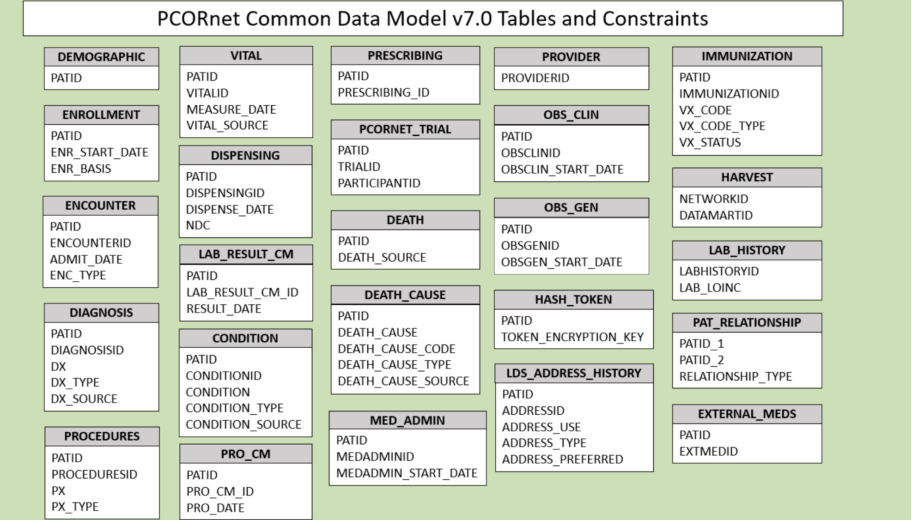
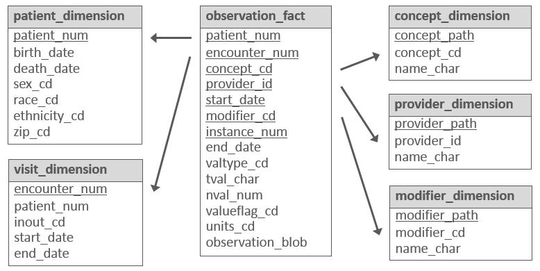

A Common Data Model (CDM) is a set of standardized data schemas that are used across organizations. CDMs can facilitate research by making it possible to write a single data query that will run across organizations using the same CDM. CDMs can also include standardization of which data elements are included, relationships between data elements, vocabularies used to represent concepts, and conventions or best practices for representing data. Without a CDM, a researcher would need to create a different query for each organization.

Organizations that use CDMs can form a health data network to facilitate data access by network members. For more information on how health data networks are structured, see @cdm_timeline_paper.

## CDMs and FHIR

CDMs and FHIR are both important parts of the health research data ecosystem, but differ in key ways:

### Purpose and scope

-   **CDMs:** Provide a consistent structure for storing and querying health data to facilitate research.

-   **FHIR:** Enable interoperability between health IT systems. This is often serving operational purposes (e.g., interfacing a specialty imaging system with a health system's EHR), but can include research-related systems and use cases.

### Structure

-   **CDMs:** Typically, CDMs consist of a standardized set of relational database tables, with columns for each data element. CDMs also typically define standardized [terminology](terminology.qmd) for representing concepts. CDMs may formalize specific concepts using Common Data Elements (CDEs), which "are standardized, precisely defined questions paired with a set of specific allowable responses, used systematically across different sites, studies, or clinical trials to ensure consistent data collection @ODSS_CDE."

-   **FHIR:** FHIR defines [resources](key-fhir-resources.qmd) for each type of data, which can be extended to add additional data elements as needed for a given use case. Resources have a nested structure (like a multi-level outline) rather than a tabular structure (like a spreadsheet). Base FHIR includes terminology bindings, but many are broad or weaker than the constraints needed for a specific research use case; [Implementation Guides](data-modeling-reading-igs.qmd) can narrow value sets and binding strength.

### Implementation

-   **CDMs:** Typically implemented as a database within a research data warehouse. When CDMs are used as part of a research data network, additional mechanisms may be implemented for sharing data across the network [@cdm_timeline_paper].

-   **FHIR:** Typically implemented as an API within a health IT system like an EHR, though research-specific databases may also implement FHIR (e.g., [Kids First](https://kidsfirstdrc.org)).

Because of these differences, FHIR does not obviate existing CDMs and health data networks. However, FHIR can be used in conjunction with CDMs. For example:

-   **Populating a CDM:** FHIR can be used as part of the process for populating a CDM. Typically, data are extracted from EHRs and other clinical or billing systems, transformed into the CDM's format, and then loaded into the CDM database. (Note that this type of process is generally referred to as [ETL](https://en.wikipedia.org/wiki/Extract,_transform,_load) for Extract, Transform, Load.) FHIR can be used as the input into an ETL process, which may allow for ETL logic that is more portable across institutions and EHR installations. However, portability of FHIR-based ETLs may be limited in the real world due to use of EHR-specific "local codes" and differences in FHIR API implementations.

-   **Mapping between CDMs:** For example, the [Common Data Models Harmonization IG](http://hl7.org/fhir/us/cdmh/) maps between different CDMs like OMOP and PCORNet, and aligns with US Core when possible. This IG [has not been updated since 2021](https://hl7.org/fhir/us/cdmh/history.html), but it still provides an example of an approach that can be used to map FHIR data elements to CDEs or other data models.

-   **Portable phenotypes:** FHIR and Clinical Quality Language ([CQL](https://cql.hl7.org)) were used by @brandt2022 to create phenotypes for cohort definitions. These were translated to run against the OMOP CDM. Theoretically, institutions that do not have OMOP research databases could use FHIR and CQL directly to identify cases and non-cases (but this was not tested in the paper).

### Research Implications

CDMs and FHIR address different aspects of [FAIRness](https://datascience.nih.gov/data-ecosystem) of research data. A CDM is usually most useful after data from EHRs, billing systems, registries, or other sources have been transformed into a common structure. Once the data is loaded into a CDM, researchers can run repeatable analyses using shared queries, tools, and phenotype definitions. In contrast, FHIR is usually most useful closer to the systems storing the source data like EHRs, where FHIR can be used to access the data stored in these systems in a standardized, vendor-agnostic way. FHIR should be considered as an alternative to manual or one-off approaches to accessing clinical data in research data pipelines, including those used to populate CDMs with clinical data.

## Notable CDMs

If you are not familiar with CDMs, below are some notable CDMs used in the US:

-   [OMOP (Observational Medical Outcomes Partnership)](https://www.ohdsi.org/data-standardization/)

-   [Sentinel](https://www.sentinelinitiative.org/)

-   [PCORnet (Patient-Centered Outcomes Research Network)](https://pcornet.org/)

-   [i2b2 (Informatics for Integrating Biology & the Bedside)](https://www.i2b2.org/about/index.html)

### OMOP

OMOP was originally created in 2007 by the FDA and other partners to study the effects of medical products.[@cdm_timeline_paper] It is now managed by the [OHDSI](https://www.ohdsi.org/) (Observational Health Data Science and Informatics).

[OMOP is an](https://www.ohdsi.org/data-standardization/):

> open community data standard, designed to standardize the structure and content of observational data and to enable efficient analyses that can produce reliable evidence.

.](images/omop.png){fig-alt="Diagram showing the structure of the OMOP CDM."}

OMOP uses [OHDSI standardized vocabularies](https://github.com/OHDSI/Vocabulary-v5.0/wiki). The OHDSI standardized vocabularies establish [standard concepts](https://ohdsi.github.io/TheBookOfOhdsi/StandardizedVocabularies.html#standardConcepts) for each clinical entity. When data is converted into OMOP, the source concept is mapped to the corresponding standard concept. This allows researchers to interpret and use clinical entities from different organizations.[@ohdsi_vocab]

### Sentinel

[Sentinel](https://www.sentinelinitiative.org/methods-data-tools/sentinel-common-data-model) is a CDM designed to monitor whether FDA-regulated medical products cause unexpected adverse reactions and address other postmarket safety questions.

Although FDA-regulated products undergo clinical testing before approval, the testing may miss adverse reactions. This is because the test population may not fully represent the population that uses the product. To detect and assess adverse events after approval, the FDA launched Sentinel in 2007. [See here for more information about the Sentinel data network](https://www.sentinelinitiative.org/about/how-sentinel-gets-its-data).

.](images/cdms_sentinel.png){fig-alt="Diagram describing the contents of the Sentinel CDM."}

### PCORnet

The Patient-Centered Outcomes Research Institute (PCORI) developed [PCORnet](https://pcornet.org/news/pcornet-common-data-model/) to make clinical research more streamlined, representative, and efficient. PCORnet data is largely drawn from EHRs, as well as some patient-reported and payor data. The PCORnet includes data from more than [47 million patients annually](https://pcornet.org/about/) that researchers can use for observational studies. PCORnet launched in 2014 [@fleurence2014].

{fig-alt="Diagram showing the structure of the PCORnet CDM v7.0."}

### i2b2

Developed in 2004 by Partners HealthCare (now [Mass General Brigham](https://www.wbur.org/news/2019/11/27/partners-mass-general-brigham-hospitals)) and Harvard Medical School, i2b2 is an open-source research data application framework that "provides clinical and translational investigators with the tools necessary to integrate medical record and clinical research in the genomics age." [@i2b2_wiki_intro]

i2b2 is structured differently from the other CDMs discussed here: rather than having separate data tables for each type of data (e.g., procedures and diagnoses are stored in different database tables, each with a different set of columns), i2b2 uses the same set of tables for all data types. i2b2 refers to this as the "star schema" (see diagram below). [i2b2 describes this](https://community.i2b2.org/wiki/display/BUN/1.+Introduction) as follows:

> Instead of separate tables for diagnoses, medications, and other data types, all patient observations are stored in a single "fact" table. A separate ontology describes the different codes that are placed in this fact table. As a result, institutions can use their own local codes, without having to map to common code sets. Furthermore, institutions can easily add new types of data to i2b2 and tranSMART just by extending the ontology. No changes to the database or software are needed. This enables software developers to build query, analysis, and visualization tools that are generalizable to different types of data and future-proof since the i2b2 CDM can remain stable over time.

{fig-alt="Diagram showing the i2b2 \"star schema\"."}
